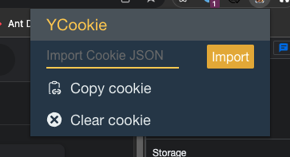

# YCookie-Chrome-Extensions
Chrome extensions for web developer. Easily export and import web cookies.

This is my first attempt at a chrome plugin application.

In daily development, we are often tired of writing script injection due to the lack of login status in the development environment. In order to simplify the usual development process, this YCookie plugin was developed.



#### **Features**

- Copy the cookie of the current page and save it to the clipboard

- Import cookies in the clipboard. Currently only the `JSON` structure in the following format is supported

  ```js
  [
    {
      "domain": "", //not necessary
      "expirationDate": 123, //not necessary
      "hostOnly": false, //not necessary
      "httpOnly": false, //not necessary
      "name": "name",  //required
      "path": "/", //not necessary
      "sameSite": "", //not necessary
      "secure": false, //not necessary
      "session": false, //not necessary
      "storeId": "0", //not necessary
      "value": "value" //required
    }
  ]
  ```

- Clear all cookies for the current page

- 

You can directly use `YCookie.crx` to install the extensions in chrome, or view the source code in `YCookie`


这是对于chrome插件应用的第一次尝试.

日常开发中, 常常因为开发环境缺少登录态而疲于写脚本注入. 为了简化平时的开发流程, 开发了这款YCookie插件.


#### 当前功能

- 复制当前页面的cookie并存入剪切板

- 导入剪切板中的cookie, 当前仅支持如下格式的`JSON`结构

  ```js
  [
    {
      "domain": "", //可以没有
      "expirationDate": 123, //可以没有
      "hostOnly": false, //可以没有
      "httpOnly": false, //可以没有
      "name": "name",  //必填
      "path": "/", //可以没有
      "sameSite": "", //可以没有
      "secure": false, //可以没有
      "session": false, //可以没有
      "storeId": "0", //可以没有
      "value": "value" //必填
    }
  ]
  ```

- 清空当前页面的所有cookie


你可以直接使用`YCookie.crx`在chrome中安装插件, 或者在`YCookie`中查看源码.
